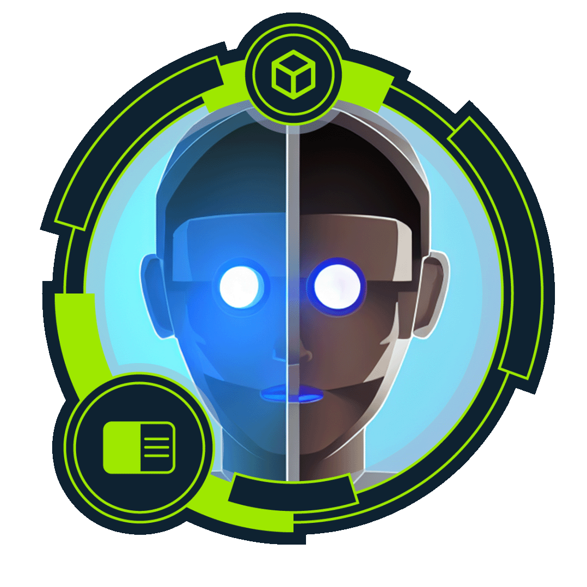
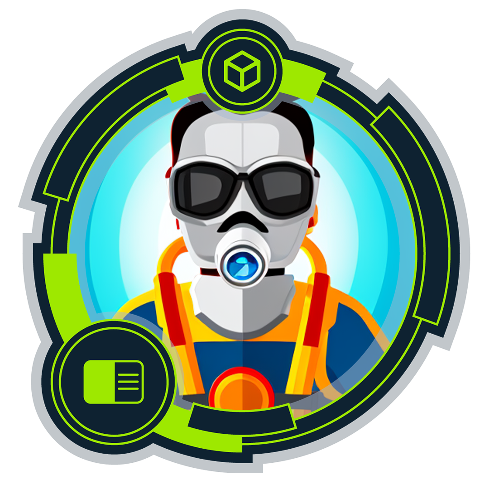
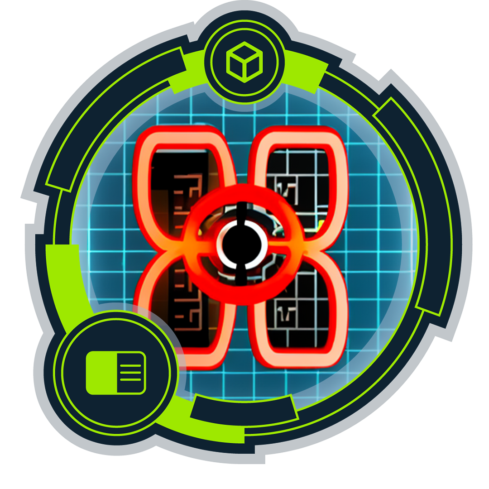
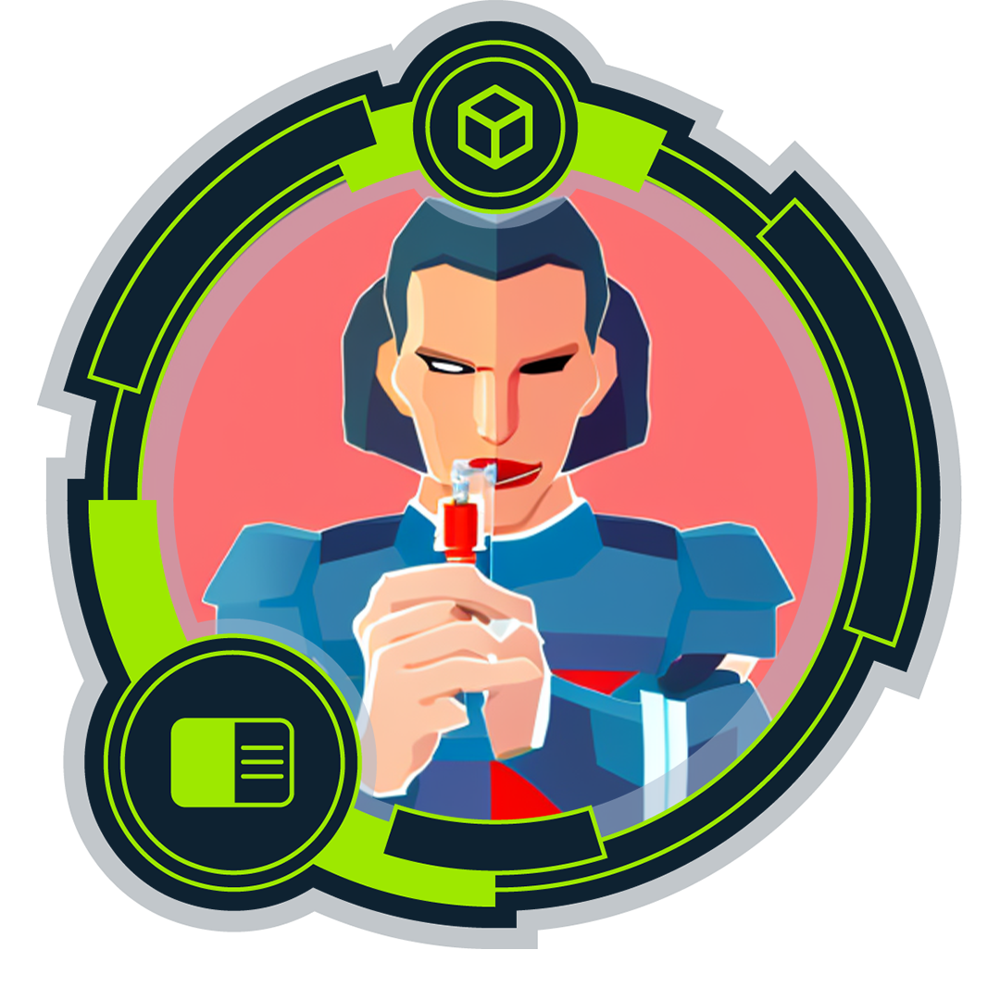

<!--
**hckcrk/hckcrk** is a ✨ _special_ ✨ repository because its `README.md` (this file) appears on your GitHub profile.

Here are some ideas to get you started:

- 🔭 I’m currently working on ...
- 🌱 I’m currently learning ...
- 👯 I’m looking to collaborate on ...
- 🤔 I’m looking for help with ...
- 💬 Ask me about ...
- 📫 How to reach me: ...
- 😄 Pronouns: ...
- ⚡ Fun fact: ...
-->
## 🎯 Cybersecurity Focused | Offensive Security Learner | Top 1% Mixing Engineer

Hi there, I’m Steve aka HckCrk 👋.  I'm a high-performance creative professional turned cybersecurity practitioner. I’m building deep expertise in offensive security, penetration testing, and red teaming. My GitHub is home to my hands-on learning journey, homelab builds, tooling experiments, writeups, and notes from platforms like Hack The Box, TryHackMe, and PentesterLab.

### 🔐 Currently exploring:

- Vulnerability discovery & exploitation techniques
- Linux and macOS hardening and hacking
- Bash/Python scripting for recon and automation
- WebApp hacking: Web fuzzing, API enumeration, network mapping, and more
- Protocols; AI, web, and wireless
- Hacking Windows and Azure Active Directory/Microsoft Entra ID

🧠 I thrive at the intersection of creativity and problem-solving. You can follow my progress and articles over at my [GitHub Pages blog](https://hckcrk.github.io) 

**Let’s break things and build better defenses.**

## 🏆 Hack The Box Academy Badges

| Badge | Image | Badge | Image |
|-------|--------|--------|--------|
| Academician |  | Unwaivering User |  |
| Constant Champion |  | Your Request Is My Demand |  |
| Cyber Starter |  | Playing With the Mess |  |
| Developer |  | Dive Into Requests |  |
| Drop Your Weapon |  | Fuzzing Guru |  |
| Included in Every Report |  | Information Is Not Knowledge (Or Is It?) |  |
| Inject With Caution |  | Join the Adventure |  |
| Philomath |  | MORE BADGES | COMING SOON |

